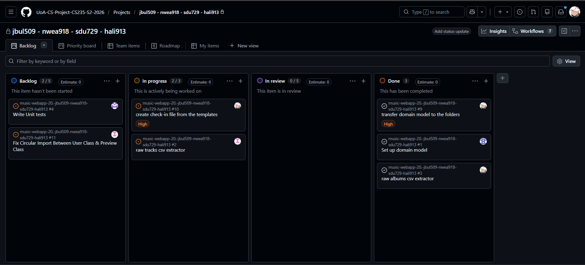

# Weekly Checkin [01]

**Team Name:** (jbul509-nwea918-sdu729-hali913)

**GitHub Repo Link:** [https://github.com/UoA-CS-Project-CS235-S2-2026/music-webapp-20.-jbul509-nwea918-sdu729-hali913](https://github.com/UoA-CS-Project-CS235-S2-2026/music-webapp-20.-jbul509-nwea918-sdu729-hali913)

**Submitted by:** Jack Franklin Bula
> Note: Rotate this role across the team over the semester. Every member should submit 2-3 times total.

**Team Members (name + GitHub handle):**
- Jack Franklin Bula — @dadpenguin
- Nathan Weaver — @nwea918
- Hameedullah Ali Reza — @hali913-pixel
- Shu Du — @Avis727

 
**Participants this week:** Franklin, Nathan, Hameedullah, Shu

**How we synced:** Discord, met in person

## Discussion / Decisions
- Task allocations
- Bug fixes in dependencies
- Two people who will handle 1 class for CSV
- use of static methods for CSV parsing

## Action Items
> Create a GitHub Issue for each action item (even a quick one-liner) and link it below.

| Task | Owner | Due | Linked Issue | Status |
|---|---|---|---|---|
| raw album CSV extractor | Franklin | 15/08/2026 | [#3](https://github.com/orgs/UoA-CS-Project-CS235-S2-2026/projects/14/views/1?pane=issue&itemId=227321171&issue=UoA-CS-Project-CS235-S2-2026%7Cmusic-webapp-20.-jbul509-nwea918-sdu729-hali913%7C3) | Done |
| Setup Domain Model | Hameed | 15/08/2026 | [#1](https://github.com/orgs/UoA-CS-Project-CS235-S2-2026/projects/14/views/1?pane=issue&itemId=227320045&issue=UoA-CS-Project-CS235-S2-2026%7Cmusic-webapp-20.-jbul509-nwea918-sdu729-hali913%7C1) | Done |
| transfer domain model to the folders | Franklin | 15/08/2026 | [#9](https://github.com/orgs/UoA-CS-Project-CS235-S2-2026/projects/14/views/1?pane=issue&itemId=229129298&issue=UoA-CS-Project-CS235-S2-2026%7Cmusic-webapp-20.-jbul509-nwea918-sdu729-hali913%7C9) | Done |
| raw tracks csv extractor | Shu | 15/08/2026 | [#2](https://github.com/orgs/UoA-CS-Project-CS235-S2-2026/projects/14/views/1?pane=issue&itemId=227320887&issue=UoA-CS-Project-CS235-S2-2026%7Cmusic-webapp-20.-jbul509-nwea918-sdu729-hali913%7C2) | Pending |
| Write Unit tests | Nathan | 15/08/2026 | [#4](https://github.com/UoA-CS-Project-CS235-S2-2026/music-webapp-20.-jbul509-nwea918-sdu729-hali913/issues/4) | Pending |
| Fix Circular Import Between User Class & Preview Class | Shu | 15/08/2026 | [#11](https://github.com/UoA-CS-Project-CS235-S2-2026/music-webapp-20.-jbul509-nwea918-sdu729-hali913/issues/11) | todo |

## Board Snapshot
> Screenshot of your GitHub Project board as of today. Save into `/weekly-checkins/screenshots/checkin-board-NN.png` (don't overwrite previous weeks).

<!---->

---
**Submission rule:** Commit this file by Saturday (any day that week works, but must be in by Saturday). Once committed, do not edit or amend it — the commit timestamp is your submission record. Any change made after Saturday's deadline will not be counted for that week.
