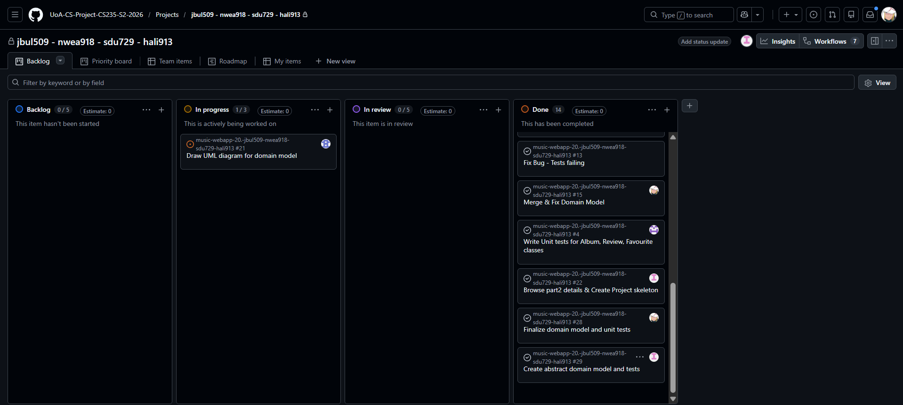

# Weekly Checkin [02]

**Team Name:** (jbul509-nwea918-sdu729-hali913)

**GitHub Repo Link:** [https://github.com/UoA-CS-Project-CS235-S2-2026/music-webapp-20.-jbul509-nwea918-sdu729-hali913](https://github.com/UoA-CS-Project-CS235-S2-2026/music-webapp-20.-jbul509-nwea918-sdu729-hali913)

**Submitted by:** Jack Franklin Bula
> Note: Rotate this role across the team over the semester. Every member should submit 2-3 times total.

**Team Members (name + GitHub handle):**
- Jack Franklin Bula — @dadpenguin
- Nathan Weaver — @nwea918
- Hameedullah Ali Reza — @hali913-pixel
- Shu Du — @Avis727

 
**Participants this week:** Franklin, Nathan, Hameedullah, Shu

**How we synced:** Discord, met in person

## Discussion / Decisions
- Task allocations
- Fix circular imports
- Fix domain models
- fix unit tests
- Refine and finalize UML diagram

## Action Items
> Create a GitHub Issue for each action item (even a quick one-liner) and link it below.

| Task | Owner | Due | Linked Issue | Status |
|---|---|---|---|---|
| Draw UML diagram for domain model | Hameed | 22/08/2026 | [#21](https://github.com/UoA-CS-Project-CS235-S2-2026/music-webapp-20.-jbul509-nwea918-sdu729-hali913/issues/21) | In progress |
| rewrite unit tests for album, Review and Favourite Classes | Nathan | 22/08/2026 | [#4](https://github.com/UoA-CS-Project-CS235-S2-2026/music-webapp-20.-jbul509-nwea918-sdu729-hali913/issues/4) | Done |
| Finalize domain model | Franklin | 22/08/2026 | [#28](https://github.com/UoA-CS-Project-CS235-S2-2026/music-webapp-20.-jbul509-nwea918-sdu729-hali913/issues/28) | Done |
| Create abstract Domain model | Shu | 22/08/2026 | [#29](https://github.com/UoA-CS-Project-CS235-S2-2026/music-webapp-20.-jbul509-nwea918-sdu729-hali913/issues/29) | Done |

## Board Snapshot
> Screenshot of your GitHub Project board as of today. Save into `/weekly-checkins/screenshots/checkin-board-NN.png` (don't overwrite previous weeks).

<!---->

---
**Submission rule:** Commit this file by Saturday (any day that week works, but must be in by Saturday). Once committed, do not edit or amend it — the commit timestamp is your submission record. Any change made after Saturday's deadline will not be counted for that week.
