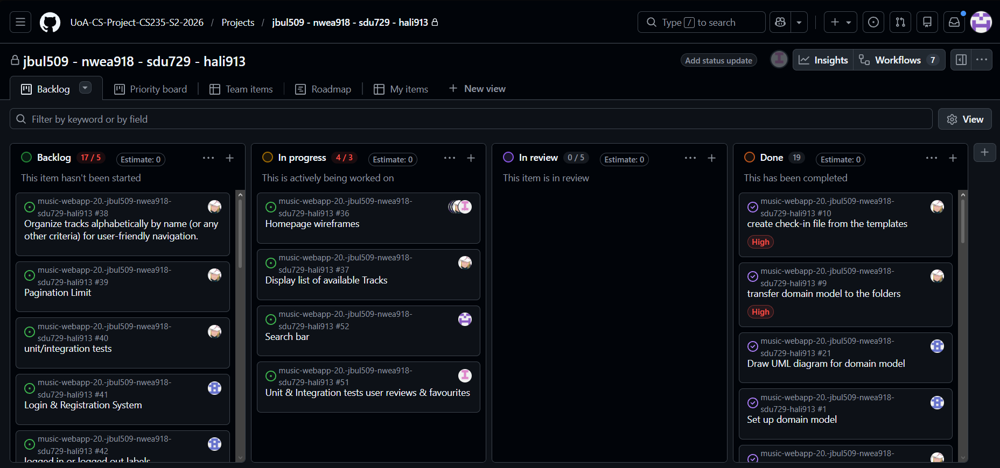

# Weekly Checkin [03]

**Team Name:** (jbul509-nwea918-sdu729-hali913)

**GitHub Repo Link:** https://github.com/UoA-CS-Project-CS235-S2-2026/music-webapp-20.-jbul509-nwea918-sdu729-hali913

**Submitted by:** Nathan Weaver
> Note: Rotate this role across the team over the semester. Every member should submit 2-3 times total.

**Team Members (name + GitHub handle):**
- Jack Franklin Bula — @dadpenguin
- Nathan Weaver — @nwea918
- Hameedullah Ali Reza — @hali913-pixel
- Shu Du — @Avis727

**Participants this week:** Franklin, Nathan, Hameedullah, Shu

**How we synced:** Discord (on a voice call)

## Discussion / Decisions
- Who is going to do what in Part 2
- Designing our website's pages
- How we are going to implement search (have its own page or use a search bar)

## Action Items
> Create a GitHub Issue for each action item (even a quick one-liner) and link it below.

| Task                                                     | Owner       | Due       | Linked Issue                                                                                                     | Status      |
|----------------------------------------------------------|-------------|-----------|------------------------------------------------------------------------------------------------------------------|-------------|
| Homepage Wireframes                                      | Everyone    | 4/09/2026 | [#36](https://github.com/UoA-CS-Project-CS235-S2-2026/music-webapp-20.-jbul509-nwea918-sdu729-hali913/issues/36) | In Progress |
| Display list of available Tracks                         | Franklin    | 4/09/2026 | [#37](https://github.com/UoA-CS-Project-CS235-S2-2026/music-webapp-20.-jbul509-nwea918-sdu729-hali913/issues/37) | In Progress |
| Search Bar                                               | Nathan      | 4/09/2026 | [#52](https://github.com/UoA-CS-Project-CS235-S2-2026/music-webapp-20.-jbul509-nwea918-sdu729-hali913/issues/52) | In Progress |
| Unit and Intergration Tests: User Reviews and Favourites | Shu         | 4/09/2026 | [#51](https://github.com/UoA-CS-Project-CS235-S2-2026/music-webapp-20.-jbul509-nwea918-sdu729-hali913/issues/51) | In Progress |
| Pagination Limit                                         | Franklin    | 7/09/2026 | [#39](https://github.com/UoA-CS-Project-CS235-S2-2026/music-webapp-20.-jbul509-nwea918-sdu729-hali913/issues/39) | Backlog     |
| Login and Registration System                            | Hameedullah | 7/09/2026 | [#41](https://github.com/UoA-CS-Project-CS235-S2-2026/music-webapp-20.-jbul509-nwea918-sdu729-hali913/issues/41) | Backlog     |
| Post and Comment Ratings                                 | Shu         | 7/09/2026 | [#46](https://github.com/UoA-CS-Project-CS235-S2-2026/music-webapp-20.-jbul509-nwea918-sdu729-hali913/issues/46) | Backlog     |
| Back Navigation Links                                    | Nathan      | 7/09/2026 | [#55](https://github.com/UoA-CS-Project-CS235-S2-2026/music-webapp-20.-jbul509-nwea918-sdu729-hali913/issues/55) | Backlog     |

## Board Snapshot
> Screenshot of your GitHub Project board as of today. Save into `/weekly-checkins/screenshots/checkin-board-NN.png` (don't overwrite previous weeks).

---
**Submission rule:** Commit this file by Saturday (any day that week works, but must be in by Saturday). Once committed, do not edit or amend it — the commit timestamp is your submission record. Any change made after Saturday's deadline will not be counted for that week.
